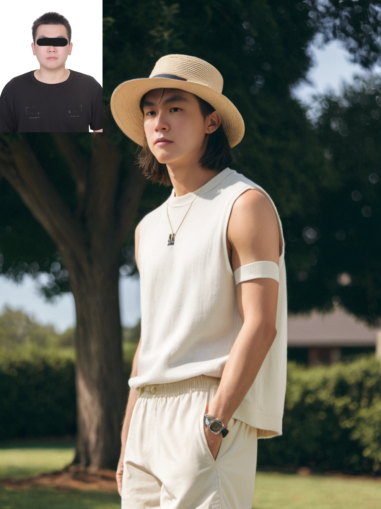

## ComfyCam

ComfyCam 輕鬆讓你的自拍變成專業照片

**! 內容有使用到換臉技術**

## 簡介
當你發現你的大頭照已經太久沒換了，你會想要換一張新的，但是你又不想要花錢去找專業攝影師拍照，那麼 ComfyCam 就是你的最佳選擇，ComfyCam 可以讓你的自拍變成專業照片，讓你的大頭照不再只是一張照片，而是一張有故事的照片。你僅僅只需要一張照片，就可以讓 ComfyCam 幫你做出專業的大頭照。

## 使用說明
1. 安裝 ComfyUI : https://github.com/comfyanonymous/ComfyUI
2. 下載 SDXL 模型 : https://civitai.com/models/124421/xxmix9realisticsdxl
3. 下載 ComfyUI 的 package: https://github.com/Gourieff/comfyui-reactor-node
4. 下載 ComfyUI Manager： https://github.com/ltdrdata/ComfyUI-Manager
5. 使用裡面所提供的 ComfyUI workflow

設備限制:
最好是有一台 8GB 以上的顯卡，否則會有記憶體不足的問題，或花費較長的時間。

## 使用警告
1. 請勿使用他人的照片，除非你有他人的同意。
2. 網站模型並非為商業用途，請勿使用於商業用途。
3. 此專案僅為學術研究，請勿使用於非法用途。

## 範例
保護隱私，所以將人臉打碼。

男生的範例:

---
女生的範例:

